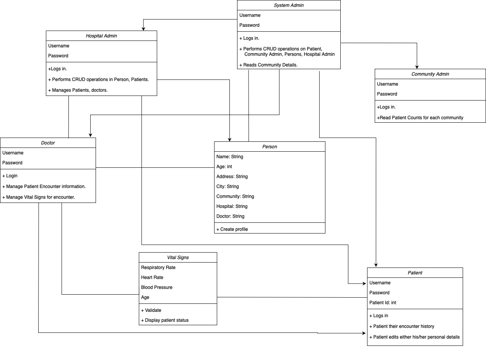
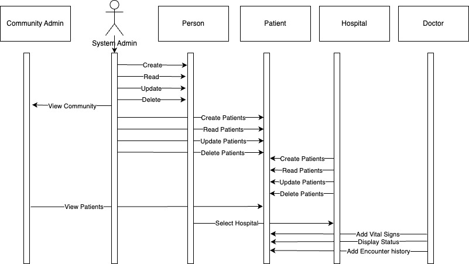

# Hospital Management System using JavaSwing

Created a java-swing based Health Management Portal for assignment (INFO-1500)
The scope of the assignment is :
-For people to find hospitals in their community
-To perform CRUD operations on person, patient, community and their encounters
-For doctors to add encounter and change Vital Signs of the patients
-For the Community Admins to change information realated to the community
-For the System Admin to perform CRUD operations on all the other admins

## Class Diagram:
<br>

<br><br>

## Sequence Diagram:

<br>

<br><br>


## Required Tools:
```
Netbeans, java developer kit
```


## NUID : 002770306

